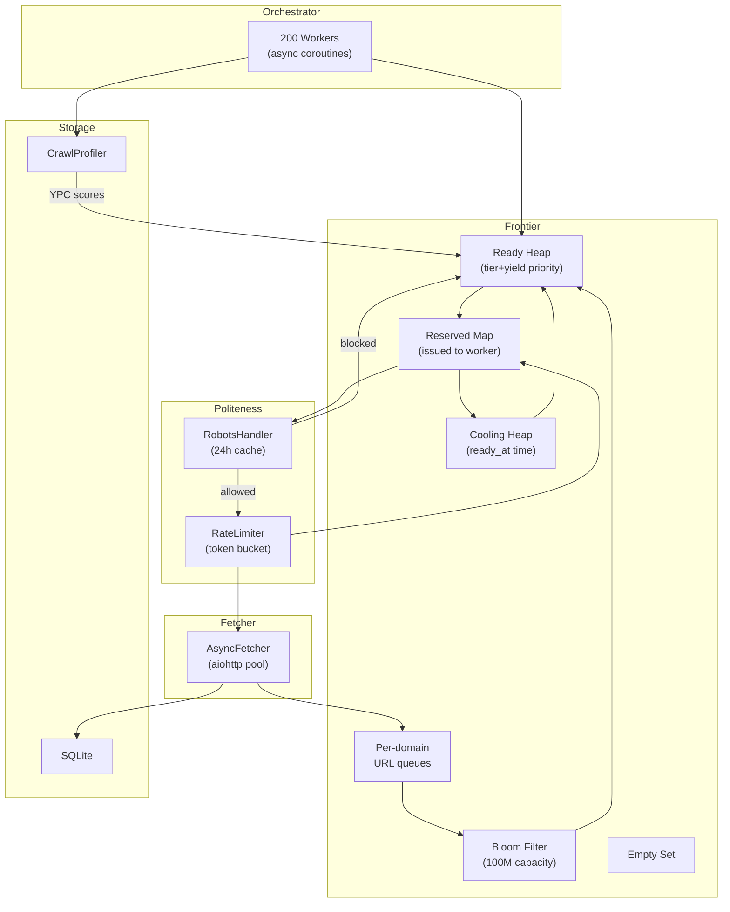

# HW1 Crawler — Architecture & Algorithm Report

## Overview

An async Python web crawler built on `aiohttp` + `asyncio`, designed for **48-hour long-running crawls** with 200 concurrent workers. Goal: maximize **unique URL discovery** while maintaining strict politeness compliance.

## Architecture



## Core Algorithm: Four-State Domain Scheduling

### Domain States

| State | Structure | Semantics |
|-------|-----------|-----------|
| **Ready** | Max-heap by tier+yield | Has URLs, cooldown expired → pick highest priority first |
| **Reserved** | `dict[domain → reservation_id]` | URL issued to a worker, awaiting `mark_acquired` or `release_issued_url` |
| **Cooling** | Min-heap by `ready_at` | Has URLs, waiting for rate-limit cooldown |
| **Empty** | Set | No pending URLs → dormant until `add_url()` reactivates |

### State Transitions

```
Ready    → Reserved: get_next() issues a URL; domain gets a reservation_id
Reserved → Cooling:  worker calls mark_acquired() after claiming rate slot
Reserved → Ready:    worker calls release_issued_url() (robots block, etc.)
Cooling  → Ready:    cooldown expires (promoted at head of next get_next())
Reserved → Empty:    domain queue drained when worker finalizes
Empty    → Ready:    add_url() adds a URL to an empty domain
```

The **Reserved** state prevents a second worker from racing to steal a domain's next URL while the first worker is still acquiring its rate-limit slot. This makes the rate-limiter the single authoritative gate rather than duplicating logic in the frontier.

### `get_next()` — O(log N), No Scanning

```
1. Promote: pop all expired entries from Cooling → push to Ready
2. Pick:    pop highest-priority domain from Ready heap
           (every 5th pick: enforce ≥1 non-new domain to prevent starvation)
3. Issue:   pop shallowest URL from that domain's queue (BFS within domain)
4. Reserve: stamp URL with reservation_id; domain moves to Reserved
```

### Tiered Priority

```
_effective_priority(domain):
  issue_count == 0          → 3,000,000  (New: explore immediately)
  issue_count < 3           → 2,000,000  (Warmup: lock in early crawls)
  issue_count ≥ 3           → min(ypc_score, 1,000,000)  (Mature: yield-driven)
```

- **New domains** get highest priority so BFS naturally fans out to fresh territory
- **Warmup** (2–3 fetches) ensures a domain gets enough early crawls to build a useful yield estimate before being compared to mature domains
- **Mature** domains compete purely on `yield_per_crawl = discovered / crawled`
- YPC scores are pushed from `CrawlProfiler` to Frontier every 30 s
- Every 5th `get_next()` call reserves a slot for a non-new domain, preventing all workers from piling onto newly-discovered seed domains

**Why tiers instead of a single yield score?** A brand-new domain always has `ypc = 1.0` (default), which is too low to compete against mature high-yield domains. Tiers guarantee every new domain gets its first few crawls before entering the yield race, enabling true BFS organic discovery.

## Politeness Compliance

### Rate Limiting (Two-Layer)

| Layer | Where | Mechanism |
|-------|-------|-----------|
| **Coarse** | Frontier (Ready/Cooling) | Cooldown checker prevents issuing domains still in cooldown |
| **Precise** | Worker (before fetch) | Per-domain token bucket with `Crawl-delay` support |

- Default: **0.5 QPS per domain** (2s between requests)
- `Crawl-delay` from robots.txt overrides if stricter
- UA-aware parsing: only uses `Crawl-delay` from matching `User-agent` block

### robots.txt Compliance

- 2xx → parse rules, enforce Allow/Disallow
- 4xx → allow all (no robots.txt)
- 5xx / timeout → disallow all (conservative)
- 24-hour cache TTL, per-domain locks prevent thundering herd

## Discovery Strategy: Organic BFS Only

All URL discovery is driven purely by link extraction from crawled HTML pages — no sitemap pre-seeding. This is intentional:

- **Tier scheduler depends on accurate YPC estimates.** Bulk-injecting 280K URLs from a sitemap floods the frontier with a single domain's New-tier slots, starving all other domains and breaking the tier priority invariants.
- **Sitemaps skew toward old/stale URLs.** BFS from real pages naturally surfaces recently updated content, and the yield metric will amplify high-discovery domains without manual hints.
- **Frontier cap is better spent on organic spread.** 5M pending slots distributed across 70K+ domains (≈70 URLs/domain) is more valuable than one domain owning 280K of those slots.

The tiers + BFS combination achieves the same goal — covering a domain broadly in the first few crawls — without any manual sitemap logic.

## Memory Protection

| Mechanism | Config | Purpose |
|-----------|--------|---------|
| **Frontier cap** | `max_pending: 5,000,000` | Hard limit on queued URLs (~500 MB) |
| **Bloom filter** | `capacity: 100,000,000` | O(1) dedup at ~160 MB |
| **Latency buffer** | `deque(maxlen=10,000)` | Bounded percentile tracking |
| **HTML size limit** | `5 MB per page` | Prevents OOM from giant pages |}

URLs exceeding the frontier cap are still **bloom-marked** and counted as **discovered** — they just don't enter the crawl queue.

## Zombie Connection Prevention

```python
aiohttp.ClientTimeout(
    total=10,        # overall request limit
    sock_connect=10, # TCP handshake timeout
    sock_read=10,    # per-read timeout (kills zombie connections)
)
```

Previous 5h crawl showed p95 latency spiking to **35 minutes** from zombie connections that `total` timeout alone didn't catch. Adding `sock_read` prevents this.

## Monitoring

The `CrawlProfiler` reports every 30s:

- **Throughput**: crawled, success rate, QPS
- **Discovery**: new URLs, dropped (cap), yield per page, unique domains
- **Latency**: p50/p95/p99 from last 1,000 requests
- **Workers**: active/robots/rate-wait/idle percentages
- **Frontier States**: Ready/Cooling/Empty counts + promotions
- **Top Domains**: ranked by yield score

## Graceful Shutdown

- First `Ctrl+C` → cancel all worker tasks → workers catch `CancelledError` → checkpoint saves → clean exit
- Second `Ctrl+C` → immediate `os._exit(1)`

## Key Metrics (5h Lab Run, c=200)

| Metric | Value |
|--------|-------|
| Pages crawled | 1,391,742 |
| Unique URLs discovered | 89,111,359 |
| Unique domains | 67,629 |
| Success rate | 93.3% |
| Peak QPS | 107.3 |
| Connection errors | 0.9% |
| Frontier cap drops | 82.7M (92.8% of discovered) |
