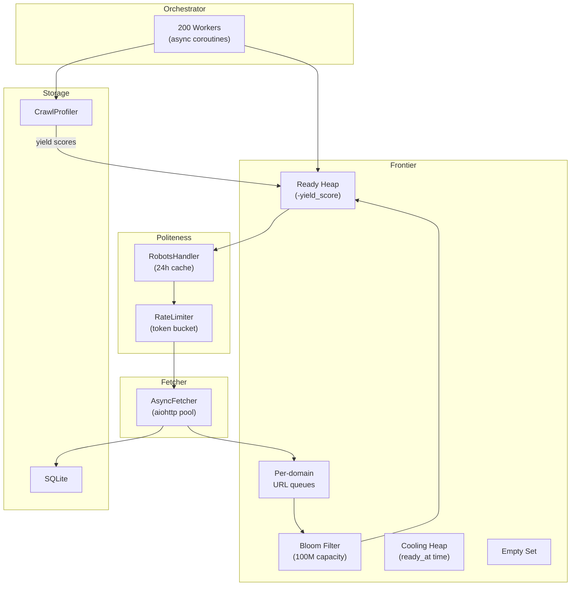

# HW1 Crawler — Architecture & Algorithm Report

## Overview

An async Python web crawler built on `aiohttp` + `asyncio`, designed for **48-hour long-running crawls** with 200 concurrent workers. Goal: maximize **unique URL discovery** while maintaining strict politeness compliance.

## Architecture



## Core Algorithm: Three-State Domain Scheduling

### Domain States

| State | Structure | Semantics |
|-------|-----------|-----------|
| **Ready** | Max-heap by yield score | Has URLs, cooldown expired → pick highest yield first |
| **Cooling** | Min-heap by `ready_at` | Has URLs, waiting for rate-limit cooldown |
| **Empty** | Set | No pending URLs → dormant until `add_url()` reactivates |

### `get_next()` — O(log N), No Scanning

```
1. Promote: pop all expired entries from Cooling → push to Ready
2. Pick:    pop highest-yield domain from Ready heap
3. Return:  pop shallowest URL from that domain's queue (BFS within domain)
4. Transition:
   - Domain still has URLs → push to Cooling (cooldown = max(rate_limiter, 2s))
   - Domain queue empty   → move to Empty
```

### Yield-Based Priority

```
yield_score(domain) = discovered_urls / (pages_crawled + 1)
```

- New/unknown domains start at score **1.0** (neutral — explore first)
- Domains that produce many new URLs get higher scores → picked more often
- Error-heavy domains (>80% error rate) get score **-1.0** → deprioritized
- Scores pushed from Profiler to Frontier every 30s

**Why yield instead of depth?** Our real goal is maximizing `discovered` count. A domain like `bbc.com` (yields 281K URLs per page) is far more valuable than a domain yielding 5 URLs. Yield weighting naturally drives the crawler toward discovery-rich domains.

## Politeness Compliance

### Rate Limiting (Two-Layer)

| Layer | Where | Mechanism |
|-------|-------|-----------|
| **Coarse** | Frontier (Ready/Cooling) | Cooldown checker prevents issuing domains still in cooldown |
| **Precise** | Worker (before fetch) | Per-domain token bucket with `Crawl-delay` support |

- Default: **0.5 QPS per domain** (2s between requests)
- `Crawl-delay` from robots.txt overrides if stricter
- UA-aware parsing: only uses `Crawl-delay` from matching `User-agent` block

### robots.txt Compliance

- 2xx → parse rules, enforce Allow/Disallow
- 4xx → allow all (no robots.txt)
- 5xx / timeout → disallow all (conservative)
- 24-hour cache TTL, per-domain locks prevent thundering herd

## Sitemap Strategy: Bloom All, Queue 500

```
fetch_sitemap(domain):
  1. Get sitemap XML URLs from robots.txt (max 3 per domain)
  2. Fetch each XML (with retries + exponential backoff + rate limiting)
  3. Queue first 500 URLs → enter bloom + domain queue (will be crawled)
  4. Mark remaining URLs → bloom-only (count as discovered, won't be crawled)
```

**Rationale:** With 70K+ domains at 80 QPS, each domain gets ~200 crawls in 48h. Queuing 280K URLs from one sitemap wastes frontier space. Queue 500 provides ample seed pages while bloom-marking the rest prevents BFS from "re-discovering" them.

## Memory Protection

| Mechanism | Config | Purpose |
|-----------|--------|---------|
| **Frontier cap** | `max_pending: 5,000,000` | Hard limit on queued URLs (~500 MB) |
| **Bloom filter** | `capacity: 100,000,000` | O(1) dedup at ~160 MB |
| **Latency buffer** | `deque(maxlen=10,000)` | Bounded percentile tracking |
| **Sitemap queue limit** | `500 per XML` | Prevents single domain flooding frontier |
| **HTML size limit** | `5 MB per page` | Prevents OOM from giant pages |

URLs exceeding the frontier cap are still **bloom-marked** and counted as **discovered** — they just don't enter the crawl queue.

## Zombie Connection Prevention

```python
aiohttp.ClientTimeout(
    total=10,        # overall request limit
    sock_connect=10, # TCP handshake timeout
    sock_read=10,    # per-read timeout (kills zombie connections)
)
```

Previous 5h crawl showed p95 latency spiking to **35 minutes** from zombie connections that `total` timeout alone didn't catch. Adding `sock_read` prevents this.

## Monitoring

The `CrawlProfiler` reports every 30s:

- **Throughput**: crawled, success rate, QPS
- **Discovery**: new URLs, dropped (cap), yield per page, unique domains
- **Latency**: p50/p95/p99 from last 1,000 requests
- **Workers**: active/robots/rate-wait/idle percentages
- **Frontier States**: Ready/Cooling/Empty counts + promotions
- **Top Domains**: ranked by yield score

## Graceful Shutdown

- First `Ctrl+C` → cancel all worker tasks → workers catch `CancelledError` → checkpoint saves → clean exit
- Second `Ctrl+C` → immediate `os._exit(1)`

## Key Metrics (5h Lab Run, c=200)

| Metric | Value |
|--------|-------|
| Pages crawled | 1,391,742 |
| Unique URLs discovered | 89,111,359 |
| Unique domains | 67,629 |
| Success rate | 93.3% |
| Peak QPS | 107.3 |
| Connection errors | 0.9% |
| Frontier cap drops | 82.7M (92.8% of discovered) |
